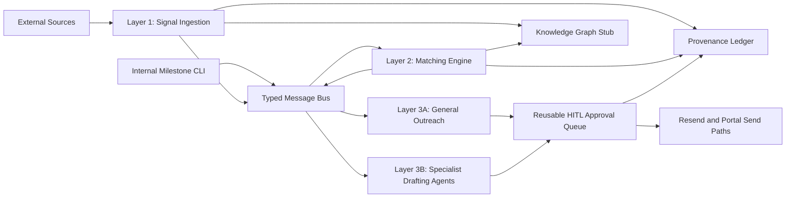
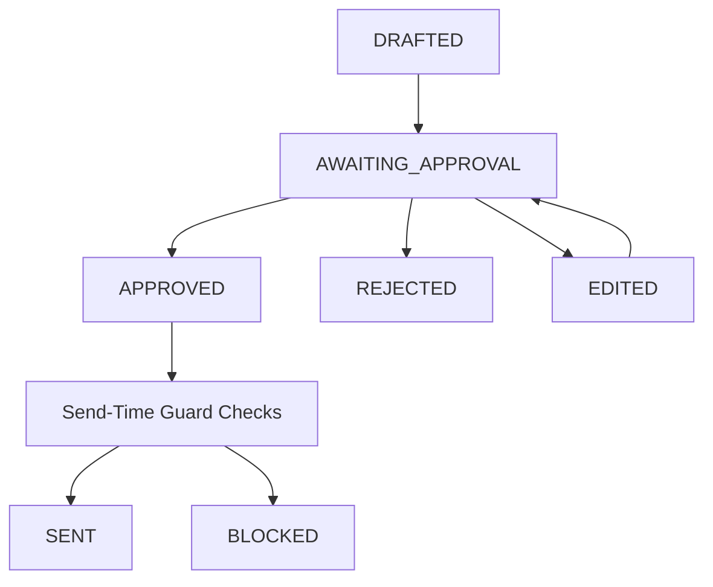

# Phase 2 MVP Plan: Unified External Signal & Communications Platform

Client: CureForge AI Institute / Longevity InTime  
Assignee: Ali Nawaz  
Timeline: 7-day architectural-stub MVP  
Primary brief: `Phase2 Task Brief Ali Nawaz.docx`

## Executive Summary

This MVP will demonstrate one complete, auditable happy path across the unified communications platform:

`external signal -> typed bus -> matching engine -> outreach candidate -> human approval -> send -> reply -> intent classification -> dashboard/audit trail`

The implementation will be a Python monorepo, proposed as `cureforge-comms`, with three main layers, six specialist drafting agents, and shared federation primitives. The week-one goal is not full production hardening. The goal is to prove the architecture works end-to-end with typed events, human-in-the-loop approval, cooldown enforcement, provenance logging, and mocked external-service tests.

If the 7-day window becomes too tight, the protected scope is the full happy path above. Optional connectors, dashboard polish, and deeper portal conformance work should be deferred before compromising the approval gate, typed bus, audit ledger, or deterministic matching model.

## MVP Scope

### Layer 1: Signal Ingestion

Build ingestion modules that normalize external signals, reject duplicates before expensive parsing, classify items against the canonical CureForge taxonomy, and publish typed events to the bus.

Included in week one:

- Telegram ingestion module from Arshie's pipeline, keeping monitoring and article parsing.
- Removal of direct ClickUp task creation, `SalesInvestorAgent`, and per-article letter generation from Layer 1.
- PubMed ingestion via NCBI E-utilities.
- ClinicalTrials.gov ingestion via API v2.
- SHA256 deduplication on normalized content before LLM parsing.
- Relevance pre-filter using keyword matching plus embedding similarity against CureForge topic vectors.
- Institute classification using only canonical taxonomy IDs.
- Postgres persistence for raw/source records, parser output, downstream event IDs, and dedup keys.
- Structured JSON logs, UTC timestamps, external-call backoff, and configurable polling intervals.

Layer 1 emits `external_signal.*` events only. Any ClickUp integration must be a subscriber, not part of ingestion.

### Layer 2: Matching Engine

Build the missing relationship intelligence layer from scratch. It consumes external signals and internal milestones, scores relationship records, and emits ranked outreach candidates. It does not send outreach.

Included in week one:

- Contact intelligence database in Postgres.
- Manual contact curation/import CLI, extending the existing investor seed format.
- Manual `internal_milestone.*` publisher CLI for MVP testing.
- Deterministic scoring with configurable weights.
- Per-contact-type scoring modules for investors, grant officers, KOLs, partners, and data custodians.
- LLM-generated rationale only after deterministic ranking.
- 60-day cooldown enforcement at ranking time.
- Hard confidentiality filtering for internal milestones.
- Dashboard audit view for contacts and recent matching events.

The matching layer must remain inspectable and reproducible. The LLM explains a decision; it does not decide who should be contacted.

### Layer 3A: General Outreach Execution

Adapt the existing communication agent so outreach is triggered only by `outreach_candidate.*` events and always passes through the reusable approval queue.

Included in week one:

- Removal of CSV-triggered outreach sends.
- Draft generation from ranked candidate events.
- Approval queue integration using an architecture-enforced state machine.
- Resend send path that refuses any message without a valid `APPROVED` state token.
- Send-time cooldown re-check immediately before Resend delivery.
- Existing reply loop retained.
- New `meeting_requested` intent category that triggers Telegram notification to a configured chat.
- Dashboard views for approval queue, contact intelligence, ingestion health, message chain, reply, and intent status.

Real external outreach should remain sandbox/test-inbox only until DNS, inbound routing, reviewer identities, and approval-token behavior are verified.

### Layer 3B: Specialist Drafting Agents

Keep all six specialist agents in scope, but reposition them as event-triggered drafting subsystems behind the same approval queue.

Included in week one:

- Grant Agent subscribes to `specialist_request.grant`.
- Preprint Agent subscribes to `specialist_request.preprint`.
- Journal Agent subscribes to `specialist_request.journal`.
- Patent Agent subscribes to `specialist_request.patent`.
- DUA Agent subscribes to `specialist_request.dua`.
- FDA Agent subscribes to `specialist_request.fda`.
- All outputs enter the shared approval queue.
- Role-based reviewer enforcement is required before approval.
- Wrong-role approval attempts are rejected and tested.
- Every generated output includes the required `AI-DRAFTED - NOT FOR SUBMISSION WITHOUT [role] REVIEW` warning.
- Drafts, revisions, approval tokens, and submission attempts are logged to the ledger.
- Portal submission remains manually confirmed with reviewer two-factor confirmation.

The MVP wraps and gates the agents. It does not re-verify arXiv SWORD v2, JATS schema conformance, eCTD ICH v4.0 conformance, USPTO prior-art accuracy, Grants.gov behavior, FDA ESG behavior, Editorial Manager behavior, or NIH RePORTER reliability.

### Cross-Cutting Federation Primitives

Week-one implementation includes:

- Typed bus interface with Redis pub/sub stub, designed so NATS JetStream can replace it later.
- Reusable `cureforge_hitl` approval package, independent of Streamlit.
- Local SQLite-backed cryptographic ledger with deterministic JSON canonicalization.
- Local SQLite-backed knowledge graph stub behind a clean client interface.
- Canonical taxonomy loader that never invents categories.
- Dockerfiles per service and `docker-compose.yml` for local development.
- `.env.example`, pinned dependencies, CI, and structured JSON logging.

## Explicit Non-Scope For Week One

- bioRxiv ingestion, unless all required work is complete early.
- Crunchbase, PitchBook, Affinity, or other commercial relationship-data connectors.
- Full external ledger anchoring.
- Full production hardening of every subsystem.
- Autonomous filing or autonomous portal submission.
- Re-verification of specialist-agent portal/spec compliance.
- A 70% test coverage target.
- Auto-publishing from the wider CureForge federation into `internal_milestone.*`.
- Real outbound client outreach before DNS, approval, sandbox, and reviewer-role checks are confirmed.

## Proposed Architecture



Layer boundaries are mandatory. No layer should call another layer's internals directly. Cross-layer communication happens through typed bus topics and persisted event payloads.

## Proposed Bus Topics

Use lowercase, dot-separated topics:

- `external_signal.telegram.<institute_id>`
- `external_signal.pubmed.<institute_id>`
- `external_signal.clinicaltrials_gov.<institute_id>`
- `external_signal.biorxiv.<institute_id>` for future/stretch work
- `internal_milestone.<milestone_type>.<institute_id>`
- `outreach_candidate.created`
- `outreach_candidate.suppressed`
- `approval.drafted`
- `approval.awaiting_approval`
- `approval.approved`
- `approval.rejected`
- `approval.edited`
- `message.sent`
- `message.reply_received`
- `message.intent_classified`
- `meeting.requested`
- `specialist_request.grant`
- `specialist_request.preprint`
- `specialist_request.journal`
- `specialist_request.patent`
- `specialist_request.dua`
- `specialist_request.fda`

For topics containing `institute_id`, IDs should be serialized as strings because the provided taxonomy contains non-integer IDs such as `19sub` and `34-AaD`. This avoids data loss and avoids special-case handling later.

## Event Ownership

- Layer 1 owns `external_signal.*`.
- Manual milestone CLI owns `internal_milestone.*` for the MVP.
- Layer 2 owns `outreach_candidate.*`.
- `cureforge_hitl` owns `approval.*` events and approval-token issuance.
- Layer 3A owns general outreach draft, send, reply, and intent events.
- Layer 3B owns specialist draft creation, but approval remains owned by `cureforge_hitl`.
- Ledger and KG clients observe/write records but do not own business workflow decisions.

## Core Event Payloads

The MVP should enforce schemas at the bus boundary so invalid events fail early.

`external_signal.*` must include:

- `event_id`
- `source`
- `source_url`
- `ingest_timestamp`
- `content_hash`
- `parsed_summary`
- `institutes`
- `topics`
- `raw_text_ref`
- `classifier_confidence`
- `parser_confidence`
- `provenance_hash`

`internal_milestone.*` must include:

- `event_id`
- `milestone_type`
- `institute_id`
- `title`
- `summary`
- `narrative_for_outreach`
- `supporting_evidence_refs`
- `confidentiality_tier`
- `occurred_at`
- `ingest_timestamp`
- `provenance_hash`

`outreach_candidate.*` must include:

- `candidate_id`
- `contact_id`
- `triggering_event_id`
- `match_score`
- `match_rationale`
- `suggested_message_angle`
- `suggested_channel`
- `confidence`

All timestamps are ISO 8601 UTC. All payloads that reference taxonomy IDs should serialize IDs as strings unless the client explicitly rejects this normalization.

## Approval State Machine



Required rules:

- Only `AWAITING_APPROVAL` items can become `APPROVED`, `REJECTED`, or `EDITED`.
- `EDITED` drafts must return to `AWAITING_APPROVAL`.
- Send functions refuse payloads without a valid `APPROVED` token.
- Approval tokens carry reviewer identity, reviewer role, draft ID, issue timestamp, and expiration.
- Wrong-role tokens are rejected.
- Expired or replayed tokens are rejected.
- Layer 3A re-checks the 60-day cooldown immediately before send.
- Specialist portal submission still requires final two-factor confirmation at send time.

Reviewer role requirements:

- Patent Agent: `patent_counsel`
- FDA Agent: `regulatory_advisor`
- DUA Agent: `regulatory_advisor` or `institutional_legal`
- Preprint Agent: `principal_investigator`
- Journal Agent: `principal_investigator`
- Grant Agent: `grants_administrator`

## Contact Intelligence DB DDL Outline

```sql
CREATE TYPE contact_type AS ENUM (
  'INVESTOR',
  'GRANT_OFFICER',
  'KOL',
  'PARTNER',
  'DATA_CUSTODIAN'
);

CREATE TYPE contact_channel_type AS ENUM (
  'email',
  'linkedin',
  'x',
  'phone',
  'other'
);

CREATE TABLE contacts (
  contact_id UUID PRIMARY KEY,
  contact_type contact_type NOT NULL,
  name TEXT NOT NULL,
  organization TEXT,
  role TEXT,
  focus_areas TEXT[] NOT NULL DEFAULT '{}',
  stated_thesis_text TEXT,
  stated_thesis_tags TEXT[] NOT NULL DEFAULT '{}',
  portfolio_companies TEXT[] NOT NULL DEFAULT '{}',
  check_size_min NUMERIC,
  check_size_max NUMERIC,
  grant_size_min NUMERIC,
  grant_size_max NUMERIC,
  fund_stage TEXT,
  institution_stage TEXT,
  under_nda BOOLEAN NOT NULL DEFAULT FALSE,
  disinterest_flag BOOLEAN NOT NULL DEFAULT FALSE,
  active_conversation_token TEXT,
  last_external_activity_date DATE,
  last_contact_from_us_date DATE,
  warm_signal_score INTEGER NOT NULL DEFAULT 0 CHECK (warm_signal_score BETWEEN 0 AND 100),
  warm_signal_rationale TEXT,
  contact_channels JSONB NOT NULL DEFAULT '{}'::jsonb,
  source_provenance JSONB NOT NULL DEFAULT '{}'::jsonb,
  created_at TIMESTAMPTZ NOT NULL DEFAULT now(),
  updated_at TIMESTAMPTZ NOT NULL DEFAULT now()
);

CREATE TABLE contact_events (
  contact_event_id UUID PRIMARY KEY,
  contact_id UUID NOT NULL REFERENCES contacts(contact_id),
  event_type TEXT NOT NULL,
  event_payload JSONB NOT NULL,
  provenance_hash CHAR(64),
  created_at TIMESTAMPTZ NOT NULL DEFAULT now()
);

CREATE TABLE matching_runs (
  matching_run_id UUID PRIMARY KEY,
  triggering_event_id UUID NOT NULL,
  triggering_topic TEXT NOT NULL,
  scoring_config JSONB NOT NULL,
  created_at TIMESTAMPTZ NOT NULL DEFAULT now()
);

CREATE TABLE outreach_candidates (
  candidate_id UUID PRIMARY KEY,
  matching_run_id UUID NOT NULL REFERENCES matching_runs(matching_run_id),
  contact_id UUID NOT NULL REFERENCES contacts(contact_id),
  triggering_event_id UUID NOT NULL,
  match_score DOUBLE PRECISION NOT NULL,
  match_rationale TEXT NOT NULL,
  suggested_message_angle TEXT,
  suggested_channel contact_channel_type,
  confidence DOUBLE PRECISION NOT NULL CHECK (confidence >= 0 AND confidence <= 1),
  suppressed_reason TEXT,
  provenance_hash CHAR(64),
  created_at TIMESTAMPTZ NOT NULL DEFAULT now()
);
```

Notes:

- `focus_areas` uses `TEXT[]`, not integer arrays, because taxonomy IDs include strings.
- `under_nda` is required for `INVESTOR_NDA` milestone filtering.
- `disinterest_flag` prevents outreach to contacts who have opted out or signaled disinterest.
- `active_conversation_token` is the only allowed ranking-time bypass for the 60-day cooldown, pending client confirmation of token semantics.
- Commercial data connectors can later write into `source_provenance` and `contact_events` without changing the core contact table.

## Matching Rules

Base score:

```text
match_score(contact, event) =
  w1 * institute_overlap(contact.focus_areas, event.institutes) +
  w2 * topic_overlap(contact.stated_thesis_tags, event.topics) +
  w3 * warm_signal_score / 100 +
  w4 * recency_decay(contact.last_external_activity_date) -
  w5 * cooldown_penalty(contact.last_contact_from_us_date)
```

Additional hard filters:

- `INTERNAL_ONLY` milestones never generate external outreach candidates.
- `INVESTOR_NDA` milestones match only contacts with `under_nda = true`.
- Contacts with `disinterest_flag = true` are suppressed.
- Contacts contacted in the prior 60 days are suppressed unless they have an active conversation token.
- The top N candidates per event are emitted as `outreach_candidate.created`; suppressed matches are logged as `outreach_candidate.suppressed` for audit.

## Ledger And Provenance Plan

The MVP will implement a local append-only ledger using SQLite, with a Postgres-ready interface for later replacement.

Each consequential action appends one ledger record:

- External signal persisted.
- Contact record updated.
- Candidate emitted or suppressed.
- Draft created.
- Draft edited.
- Approval token issued.
- Message sent.
- Reply received.
- Specialist output generated.
- Submission attempt made.

Ledger rules:

- Payloads are canonicalized with sorted JSON keys, no whitespace, UTF-8 NFC, and stable scalar formatting.
- `payload_hash` is SHA256 of the canonicalized payload.
- `chain_hash` links each record to the previous record hash.
- The genesis record is created on first deployment.
- CI includes a seeded-chain verification test.
- The MVP publishes the chain root nightly to a local file only.
- External timestamp anchoring is documented as a future interface, not built in week one.

## Seven-Day Delivery Plan

Day 1:

- Finalize architecture plan and client questions.
- Initialize `cureforge-comms` monorepo shape.
- Implement typed bus interface with Redis stub.
- Define Postgres schemas and config structure.
- Start Layer 1 dedup and persistence.
- End-of-day demo: Telegram-origin event persisted, hashed, and published to the bus.

Day 2:

- Implement relevance pre-filter and taxonomy classifier.
- Add PubMed ingestion.
- Add taxonomy loader and topic-vector configuration.
- End-of-day demo: Telegram and PubMed items classified and visible on the bus.

Day 3:

- Build contact DB, curation/import CLI, and matching engine.
- Add configurable deterministic scoring and LLM rationale generation.
- Add manual internal milestone publisher.
- End-of-day demo: Layer 1 event produces ranked candidates in the dashboard/audit view.

Day 4:

- Integrate Layer 3A with `outreach_candidate.*`.
- Build reusable `cureforge_hitl` approval queue and dashboard views.
- Add ClinicalTrials.gov ingestion.
- Add `meeting_requested` intent and Telegram notification.
- End-of-day demo: candidate draft goes through approval and sends to a test inbox.

Day 5:

- Wrap six specialist agents behind `specialist_request.*`.
- Add role-based approval enforcement.
- Add mandatory AI-drafted headers.
- Log drafts, revisions, tokens, and submission attempts.
- End-of-day demo: at least grant, patent, and FDA/DUA flows reject wrong-role approvals and accept correct-role approvals.

Day 6:

- Complete cryptographic ledger and KG stub integration.
- Add mocked full E2E integration test.
- Add Dockerfiles, compose, and CI.
- Polish dashboard audit views.
- End-of-day demo: full mocked path with provenance hashes visible.

Day 7:

- Complete documentation and handoff materials.
- Add non-developer approval workflow guide.
- Add `docs/SPECIALIST_AGENT_STATUS.md`.
- Run final smoke tests and package sign-off checklist.
- End-of-day demo: client-ready MVP handoff with known limitations documented.

## Testing And Acceptance Criteria

Required tests:

- Layer 1 integration test with mocked Telegram/PubMed/ClinicalTrials.gov sources.
- Layer 2 integration test proving deterministic ranking, cooldown suppression, NDA filtering, and LLM-rationale separation.
- Layer 3A test proving Resend send path rejects missing or invalid approval tokens.
- Layer 3A test proving send-time cooldown re-check blocks stale candidates.
- One wrong-role rejection test per specialist agent.
- Ledger unit test verifying a seeded chain from genesis through multiple records.
- Full mocked E2E test for ingest, match, draft, approve, send, reply, classify, and dashboard/audit persistence.
- CI runs tests on every push.

MVP acceptance criteria:

- A single event can travel through the full happy path with all external services mocked.
- Every cross-layer handoff uses typed bus topics.
- No send path can bypass approval.
- Role restrictions are enforced by `cureforge_hitl`, not only by UI code.
- Contact cooldown is checked in Layer 2 and Layer 3A.
- Internal-only milestone data cannot generate external outreach candidates.
- Every consequential record has a provenance hash and ledger entry.
- Dashboard shows ingestion health, contacts, matching events, approval queue, message chain, reply, and intent classification.
- Docs state what is implemented, what is stubbed, and what is explicitly unverified.

## Client Questions And Required Confirmations

The client should only be asked for decisions, approvals, access, and business inputs that cannot be safely inferred or automated. Routine setup values such as generated DNS records, environment variable names, polling intervals, Docker/CI configuration, API rate-limit handling, and local dashboard configuration are implementation-owned and will not be pushed back to the client unless access is blocked.

## Secrets And Access Guide For MVP

We will create all configuration scaffolding ourselves: `.env.example`, Docker/compose wiring, service defaults, webhook routes, CI variables documentation, polling intervals, local database settings, and safe test defaults. The client should not need to design or provide routine configuration.

The client only needs to provide private credentials, account access, or business approvals that cannot be generated by the implementation team.

| Area | What we set up | What client provides | How it goes into the MVP |
| --- | --- | --- | --- |
| Resend | Domain setup flow, webhook route, sender/reply defaults, sandbox send mode, `.env.example` names | Resend account/API key or temporary access, and DNS/domain access owner if verification is blocked | Stored as `RESEND_API_KEY`, `RESEND_FROM_EMAIL`, `RESEND_REPLY_TO`, and inbound webhook secret in the deployed environment |
| DNS / domain | Exact DNS record values from Resend and verification checklist | Permission or access owner for `longevityintime.org` only if records are not already verified | We apply/verify records, then document verification status |
| Telegram | Bot integration path, notification helper, chat-id config slot | Bot token and target chat/channel approval, or temporary access to create them | Stored as Telegram bot token and notification chat ID in environment variables |
| LLM provider | Provider adapter, redaction hooks, prompt templates, mocked tests | Approved provider/model and API key, plus privacy approval for data classes sent to the model | Stored as provider/model/API-key variables; sensitive prompts follow approved redaction rules |
| Source repos | Monorepo structure, wrapper strategy, merge plan | Access to referenced repos if not already available | Pulled into implementation workspace or wrapped as packages, based on agreed merge approach |
| Seed contacts | Import template, validation, sample synthetic records | Sanitized seed contacts or approval to use synthetic demo contacts | Loaded through the contact curation/import CLI |
| Reviewer roles | Role model, approval-token checks, dashboard role selection | Names/emails for reviewers in required roles | Added to local reviewer seed/config and used for approval-token issuance |
| Demo policy | Sandbox mode, mocked services, test inbox flow | Approval on whether real external outreach is disabled during MVP | Enforced through environment flag and send-path guard |
| Deployment target | Local Docker/compose and handoff instructions | Preferred environment only if the MVP must run somewhere specific | Applied during handoff; local MVP works without client infrastructure |

Secrets will not be committed to the repository. The repo will include `.env.example` with placeholder names and a setup guide explaining how to obtain each key from the relevant service dashboard and where to paste it in the deployment environment.

### Blocking Before Real Sends

- Confirm who can grant DNS/domain access for `longevityintime.org` if Resend verification is not already complete.
- Confirm the preferred sender and reply addresses if the default `outreach@longevityintime.org` and `replies@longevityintime.org` are not acceptable.
- Confirm whether the MVP must stay sandbox/test-inbox only until final client sign-off.
- Confirm reviewer identities for `patent_counsel`, `regulatory_advisor`, `institutional_legal`, `principal_investigator`, and `grants_administrator`.

### Blocking Before Final Data Modeling

- Confirm canonical names for every `[name pending]` taxonomy entry.
- Confirm that `institute_id` should be treated as a string across all event schemas because the provided taxonomy contains `19sub` and `34-AaD`.
- Confirm whether institute IDs are stable forever or may be renamed/aliased later.
- Confirm the exact semantics and issuer of an `active-conversation token`.
- Confirm minimum seed contact records needed for the MVP demo and whether a sanitized contact seed will be provided.

### Blocking Before LLM Use

- Confirm approved LLM provider/model.
- Confirm whether milestone text with `INVESTOR_NDA` may be sent to the LLM for rationale/drafting.
- Confirm retention/privacy constraints for prompts, outputs, and logs.
- Confirm required redaction rules for confidential evidence refs.

### Source Repo And Integration Inputs

- Confirm when Arshie's `longevity-multi-agent` repo will be available.
- Confirm when Ali's `Communication-AI-Agent`, six specialist agents, and `investors_sample.csv` will be available.
- Confirm whether source repos should be merged into the MVP branch directly or wrapped as packages first.
- Confirm whether a ClickUp subscriber is required in week one or can be documented as a follow-up.
- Confirm Telegram bot/channel details, forwarded-message path, and whether historical backfill is required.

### Dashboard And Demo Expectations

- Confirm who the dashboard users are for the MVP demo.
- Confirm which three specialist-agent flows should be demonstrated live if all six are wrapped but only a subset can be shown.
- Confirm whether the final demo should use synthetic signals, live PubMed/ClinicalTrials.gov data, or both.

## Pushback And Risk Controls

The brief has one schema conflict: some event schemas describe `institute_id` as an integer, but the canonical taxonomy includes string IDs. The MVP should normalize IDs as strings everywhere.

The six specialist agents are substantial. In seven days, the right MVP target is to wrap all six behind shared approval, role enforcement, headers, and ledger logging. Deep compliance re-verification should remain explicitly out of scope and documented in `docs/SPECIALIST_AGENT_STATUS.md`.

Real email sending should not be enabled until DNS, inbound routing, sandbox behavior, reviewer roles, and approval-token rejection tests are confirmed. The demo can still prove the architecture through a test inbox and mocked inbound webhook.

If delivery pressure increases, the cut order should be:

- Defer bioRxiv.
- Defer ClickUp subscriber.
- Reduce dashboard polish while preserving audit visibility.
- Demonstrate three specialist agents live while keeping wrappers/tests/status docs for all six.
- Defer non-critical ingestion source polish.

The work that should not be cut is the bus interface, HITL approval gate, deterministic matching, cooldown enforcement, confidentiality filtering, provenance ledger, and the mocked full E2E test.

## Handoff Deliverables

Expected week-one deliverables:

- `cureforge-comms` monorepo.
- Three layer packages plus specialist subsystem.
- `cureforge_hitl` reusable approval package.
- Redis-backed bus stub behind a clean interface.
- Local provenance ledger and chain verification.
- Local KG stub.
- Streamlit dashboard with MVP views.
- Dockerfiles, `docker-compose.yml`, pinned dependencies, `.env.example`, and GitHub Actions CI.
- Test suite covering required critical paths.
- Engineering README for the implemented repo.
- Non-developer guide for approval workflow and dashboard use.
- `docs/SPECIALIST_AGENT_STATUS.md` documenting each specialist agent's unverified portal/spec status.

## Day-One Client Response Needed

To avoid losing day two, the most important early replies are:

- Canonical names for `[name pending]` taxonomy entries.
- Confirmation to use string taxonomy IDs everywhere.
- Domain access owner only if Resend/inbound mail is not already verified.
- Reviewer names and roles.
- LLM provider/privacy approval.
- Seed contacts and demo data expectations.
- Source repo availability and merge preference.

If any of the required day-one inputs remain missing or unclear by the end of day two, they will be escalated immediately rather than silently worked around.

Once these are confirmed, implementation can proceed without hidden assumptions.
