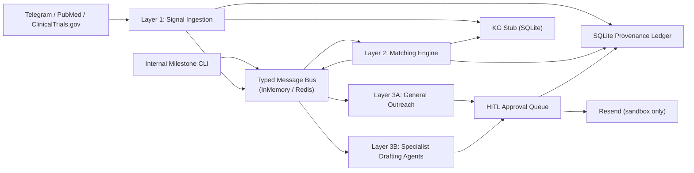

# CureForge Comms MVP

**Client:** CureForge AI Institute / Longevity InTime  
**Assignee:** Ali Nawaz  
**Status:** Implementation-complete — awaiting client credentials  
**Repo name:** `cureforge-comms-mvp`

---

## What This MVP Delivers

A Python monorepo that proves one complete, auditable end-to-end communications path:

```
external signal → typed bus → matching engine → outreach candidate
→ human approval → sandbox send → reply → intent classification → dashboard / audit trail
```

Every cross-layer handoff uses typed bus events. No send path can bypass approval. Every consequential action is recorded in a Merkle-anchored provenance ledger.

**94 tests pass. Zero lint errors. Runs fully on mock defaults — no API keys required to start.**

---

## Architecture



### Implementation Status

| Component | Status | Notes |
|---|---|---|
| Signal ingestion (Telegram, PubMed, ClinicalTrials.gov) | ✅ Real connectors | Activate with `TELEGRAM_BOT_TOKEN` / `NCBI_API_KEY` |
| Postgres dedup + signal persistence | ✅ Implemented | Falls back to in-memory without `DATABASE_URL` |
| Redis bus | ✅ Implemented | Falls back to `InMemoryBus` when `BUS_BACKEND=memory` |
| Taxonomy v0.2 loader | ✅ Implemented | 56 entities loaded (57 declared — see note below) |
| Matching engine with per-type scorers | ✅ Implemented | Deterministic scoring, GPT-4o rationale, NDA redaction |
| HITL approval queue | ✅ Implemented | Role enforcement, token issuance, wrong-role rejection |
| `active_conversation_token` lifecycle | ✅ Implemented | 30-day TTL, refreshes on reply, revoked on `not_interested` |
| Resend sandbox send | ✅ Implemented | Real HTTP call when `RESEND_API_KEY` + `RESEND_SANDBOX_TO` set |
| Resend inbound webhook (FastAPI) | ✅ Implemented | `POST /webhook`, HMAC-SHA256 verified |
| Telegram meeting notification | ✅ Implemented | Fires when reply intent = `meeting_requested` |
| Six specialist drafting agents | ✅ Implemented | Bus-subscribed, ledger-logged, portals hard-disabled |
| SQLite ledger (Merkle-anchored) | ✅ Implemented | Chain verification in dashboard Handoff tab |
| SQLite KG stub | ✅ Implemented | Nodes + edges persisted |
| Streamlit dashboard | ✅ Implemented | Multi-tab, file upload, LLM settings, ledger view, downloads |
| LLM adapters (Mock / Groq / OpenAI / Anthropic) | ✅ Implemented | Mock is default — no key needed to run |
| NDA redaction enforcement | ✅ Implemented | `INVESTOR_NDA` body stripped before every LLM prompt |
| Contact import CLI | ✅ Implemented | `make import-contacts FILE=contacts.csv` |
| Milestone publisher CLI | ✅ Implemented | `make publish-milestone TITLE="..." BODY="..."` |
| ClickUp subscriber | ✅ Implemented | Needs `CLICKUP_API_TOKEN` + list ID to activate |
| GitHub Actions CI | ✅ Implemented | Unit + Docker-compose integration jobs |
| Postgres repositories (full CRUD) | ✅ Implemented | `packages/db/repositories.py` |
| Source repo package scaffolding | ✅ Scaffolded | `packages/ingestion_agent/`, `packages/comms_agent/` — drop-in points |
| Makefile shortcuts | ✅ Added | `make help` lists all commands |

### Taxonomy discrepancy note

Client metadata declares **57 total entities** (55 institutes + 2 sub-institutes). The current `data/taxonomy_v0_2.json` contains **56 entries**. The loader stores both counts separately and does not raise an error. The missing entry must be confirmed with the client (Oleg) before final taxonomy sign-off. See `NEXT_STEPS.md` → Watch Items.

---

## Repository Structure

```
cureforge-comms-mvp/
├── apps/
│   └── dashboard/app.py              # Streamlit MVP dashboard
├── packages/
│   ├── bus/                          # InMemoryBus + RedisBus + factory
│   ├── common/                       # Schemas, hashing, time, logging
│   ├── comms_agent/                  # Scaffold — drop in ali-nawaz-dev/cureforge-comms-mvp
│   ├── db/                           # Postgres connection + repositories
│   ├── hitl/                         # Approval queue + reviewers + conversation token
│   ├── ingestion_agent/              # Scaffold — drop in arshiefatima/longevity-multi-agent
│   ├── kg/                           # KG stub (SQLite-backed)
│   ├── ledger/                       # Merkle ledger (SQLite-backed)
│   ├── llm/                          # Mock / Groq / OpenAI / Anthropic adapters
│   └── taxonomy/                     # Taxonomy loader (v0.2)
├── services/
│   ├── ingestion/                    # Pipeline + Telegram + PubMed + ClinicalTrials + ClickUp
│   ├── matching/                     # Engine + scorers + redaction + CLIs
│   ├── outreach/                     # Drafting + sender + Resend client + webhook
│   └── specialists/                  # Six specialist agents + bus wiring
├── data/
│   ├── taxonomy_v0_2.json
│   └── seeds/
│       ├── contacts.json             # 25 synthetic demo contacts
│       └── reviewers.json            # Reviewer identities (TBC placeholders)
├── migrations/
│   └── 001_core_schema.sql           # Idempotent Postgres DDL (IF NOT EXISTS)
├── tests/                            # 94 passing tests
├── docs/
│   ├── ARCHITECTURE_EVOLUTION.md     # Phase 1–4 roadmap
│   ├── HANDOFF_CHECKLIST.md          # Sign-off checklist
│   ├── NON_DEVELOPER_GUIDE.md        # Step-by-step guide for non-technical users
│   ├── SECRETS_AND_ACCESS.md         # Every env var + where to get each value
│   └── SPECIALIST_AGENT_STATUS.md    # Portal compliance status per agent
├── .env                              # Local runtime config (gitignored)
├── .env.example                      # Template — safe to commit
├── Makefile                          # One-liner dev shortcuts
├── Dockerfile
├── docker-compose.yml
├── docker-compose.test.yml
├── pyproject.toml
└── .github/workflows/ci.yml
```

---

## Quick Start

### Option A — Run locally (no Docker)

```bash
# 1. Install
pip install -e ".[dev]"

# 2. Run dashboard (mock mode, no credentials needed)
make dashboard
# → open http://localhost:8501
```

### Option B — Full stack with Docker

```bash
# Postgres + Redis + Streamlit dashboard
make docker-up
# → open http://localhost:8501
```

### Option C — Just run the tests

```bash
make test                 # 94 unit tests, no infra required
make test-all             # integration tests via Docker Compose
```

### Activating real services

Once you have the API keys, open `.env` and fill in the relevant lines, then switch providers:

```bash
# In .env:
OPENAI_API_KEY=sk-...
GROQ_API_KEY=gsk_...
RESEND_API_KEY=re_...
RESEND_SANDBOX_TO=your@email.com

PARSER_LLM_PROVIDER=groq
RATIONALE_LLM_PROVIDER=openai
DRAFTING_LLM_PROVIDER=openai
```

---

## Makefile Commands

```
make help               Show all available commands
make install            Install all dependencies (editable)
make lint               Run ruff linter
make lint-fix           Auto-fix lint errors
make test               Unit tests — no infra required
make test-verbose       Unit tests with full output
make test-all           Integration tests via Docker Compose
make dashboard          Start Streamlit dashboard (localhost:8501)
make webhook            Start FastAPI inbound webhook server (localhost:8000)
make docker-up          Start full stack (Postgres + Redis + dashboard)
make docker-down        Tear down Docker Compose stack
make migrate            Apply Postgres migrations
make import-contacts    Import contacts: make import-contacts FILE=contacts.csv
make publish-milestone  Publish milestone: make publish-milestone TITLE="..." BODY="..."
```

---

## LLM Routing

| Env Variable | Default | Confirmed Provider | Layer |
|---|---|---|---|
| `PARSER_LLM_PROVIDER` | `mock` | Groq LLaMA 3.3 70B | Layer 1 — signal parsing |
| `RATIONALE_LLM_PROVIDER` | `mock` | OpenAI GPT-4o | Layer 2 — match rationale |
| `DRAFTING_LLM_PROVIDER` | `mock` | OpenAI GPT-4o | Layer 3A — outreach drafting |

- Providers are fully swappable without touching any prompt logic.
- Anthropic adapter is retained in code for a future phase switch.
- LLM keys can also be entered live in the **dashboard sidebar → LLM Settings** — stored in browser session only, never committed to the repo.
- **NDA rule:** `INVESTOR_NDA`-tier content is stripped from all LLM prompts unconditionally.

---

## Source Repo Integration

Two upstream repos are absorbed as packages. Scaffold directories are ready:

| Target directory | Source repo | Step |
|---|---|---|
| `packages/ingestion_agent/` | `github.com/arshiefatima/longevity-multi-agent` | Copy contents in, wire to `services/ingestion/pipeline.py` |
| `packages/comms_agent/` | `github.com/ali-nawaz-dev/cureforge-comms-mvp` | Copy contents in, replace import in `services/outreach/drafting.py` |

Both `__init__.py` files contain step-by-step integration instructions.

---

## Bus Backends

| `BUS_BACKEND` | Behaviour |
|---|---|
| `memory` (default) | In-process — no Redis required |
| `redis` | `RedisBus` via `REDIS_URL` — enables multi-process fan-out |

### Bus topics (HITL + pipeline)

| Topic | Emitter |
|---|---|
| `external_signal.*` | Ingestion pipeline |
| `outreach_candidate.*` | MatcherWorker |
| `outreach_draft.created` | OutreachWorker |
| `approval.rejected` | ApprovalQueue on reject |
| `message.sent` | ApprovalQueue on successful mark_sent |
| `dlq.*` | Workers on handler failure |

Live Redis walkthrough: `PYTHONPATH=. BUS_BACKEND=redis REDIS_URL=redis://localhost:6379/0 python3.11 scripts/redis_bus_e2e.py`

---

## Explicit Non-Scope (This MVP)

- Real specialist portal submissions — all six portals raise `NotImplementedError`
- Live external outreach before DNS, approval-token, and sandbox checks are confirmed
- Production monitoring, scaling, or SLAs
- External ledger anchoring
- bioRxiv ingestion
- Crunchbase / PitchBook / Affinity connectors
- Auto-publishing into `internal_milestone.*` from the wider CureForge federation

---

## What the Client Needs to Provide

| Item | Where to put it | Status |
|---|---|---|
| `RESEND_API_KEY` | `.env` | ⏳ Pending |
| `RESEND_SANDBOX_TO` | `.env` | ⏳ Pending |
| `RESEND_WEBHOOK_SECRET` | `.env` | ⏳ Pending |
| Confirm Resend inbound MX live (Amine) | No code change | ⚠️ In progress |
| `OPENAI_API_KEY` (GPT-4o) | `.env` | ⏳ Pending |
| `GROQ_API_KEY` (LLaMA 3.3 70B) | `.env` | ⏳ Pending |
| `TELEGRAM_BOT_TOKEN` + `TELEGRAM_NOTIFY_CHAT_ID` | `.env` | ⏳ Pending |
| Real reviewer identities | `data/seeds/reviewers.json` | ⏳ Pending (TBC entries in file) |
| Taxonomy count reconciliation (56 vs 57) | `data/taxonomy_v0_2.json` | ⏳ Pending |

---

## Handoff Reference

| Document | Purpose |
|---|---|
| `docs/HANDOFF_CHECKLIST.md` | Sign-off checklist with owner + status per item |
| `docs/SECRETS_AND_ACCESS.md` | Every env var, where to get it, and how to set it |
| `docs/NON_DEVELOPER_GUIDE.md` | Step-by-step dashboard guide for non-technical users |
| `docs/SPECIALIST_AGENT_STATUS.md` | Portal compliance status per specialist agent |
| `docs/ARCHITECTURE_EVOLUTION.md` | Phase 1–4 roadmap beyond this MVP |
| `NEXT_STEPS.md` | Gap closure report and remaining watch items |
